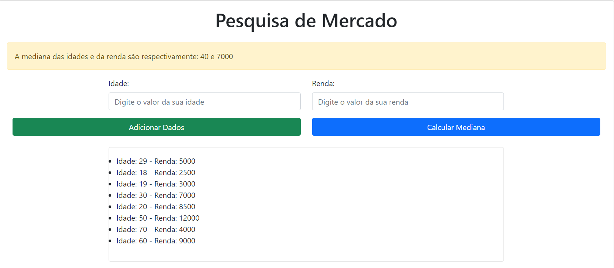

# DividirEConquistar-PesquisaDeMercado

**Número da Lista**: 3 
**Conteúdo da Disciplina**: Dividir e Conquistar 

## Aluno
| Matrícula | Aluno          |
|-----------|----------------|
| 19/0134224| Artur Reiman   |

## Sobre 
Este projeto de "Pesquisa de Mercado" tem como objetivo principal desenvolver uma aplicação que permita visualizar a mediana das idades e a renda dos possíveis clientes de uma empresa, utilizando o algoritmo dividir e conquistar das Medianas da Medianas.

## Exemplos de entrada e saída

## Tecnologias 
- HTML: para o desenvolvimento do frontend da aplicação.
- Javascript: para a criação da função do algoritmo.
- CSS: para a estilização do sistema.

Para realizar o uso do projeto basta exercer o dowload e a execução do index.html no browser da sua escolha.

## Gravação 

A fim de facilitar o entendimento completo do nosso projeto foi realizado uma gravação de uso, sendo apresentado no link abaixo:

<iframe width="560" height="315" src="https://www.youtube.com/embed/YFJtADeJ6Oo?si=y3L0sdLHT8R3SlC2" title="YouTube video player" frameborder="0" allow="accelerometer; autoplay; clipboard-write; encrypted-media; gyroscope; picture-in-picture; web-share" referrerpolicy="strict-origin-when-cross-origin" allowfullscreen></iframe>

